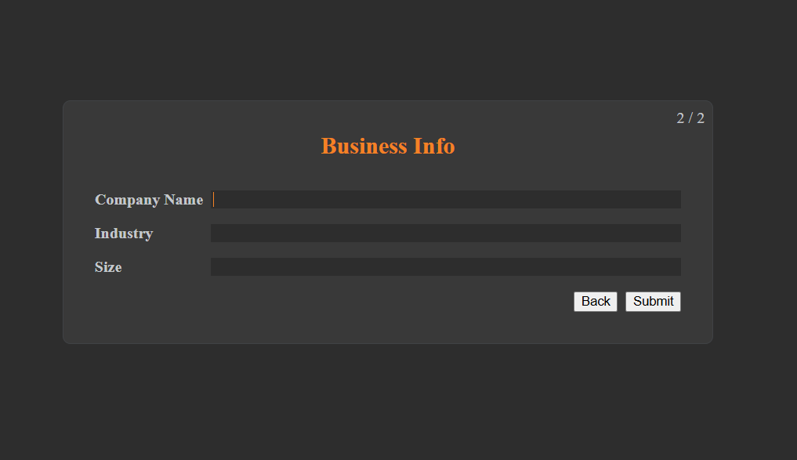
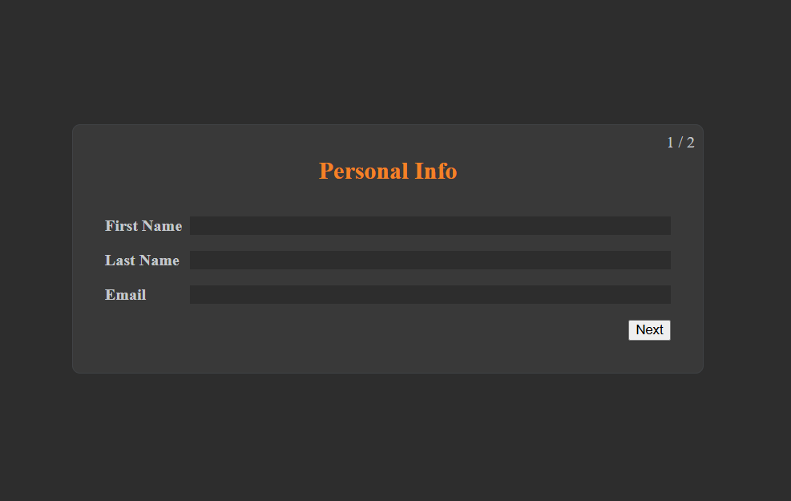

# Clone the repository

git clone 
```
https://github.com/Anirudh0308/Multi-Step-Onboading-Wizard.git
```

change directory
```
cd multi-step-onboarding
```

# Install dependencies
```
npm install
```


# Start development server
```
npm run dev
```

## 📸 Screenshot




